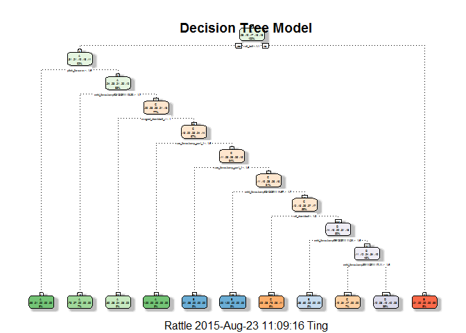
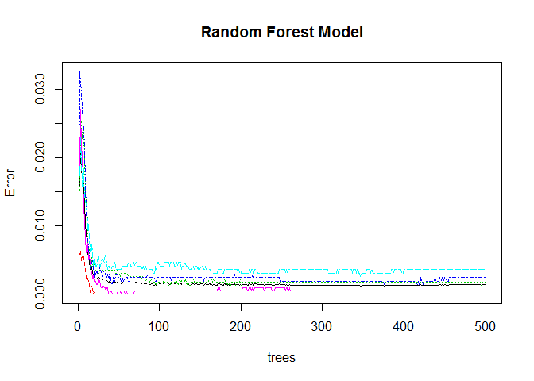

# Practical Machine Learning Project
by CLT  


### Preparing R environment
  

```
## Loading required package: lattice
## Loading required package: ggplot2
## Loading required package: RGtk2
## Rattle: A free graphical interface for data mining with R.
## Version 3.5.0 Copyright (c) 2006-2015 Togaware Pty Ltd.
## Type 'rattle()' to shake, rattle, and roll your data.
```


## Executive Summary
The purpose of this project is to build a model to predict the manner in which a group of enthusiasts exercise.  The group uses devices such as Jawbone Up, Nike FuelBand, and Fitbit to collect data about personal activity.  In this project, only data from accelerometers on the belt, forearm, arm, and dumbell of 6 participants will be used.  They were asked to perform barbell lifts correctly and incorrectly in 5 different ways.  More information is available from the website here: http://groupware.les.inf.puc-rio.br/har (see the section on the Weight Lifting Exercise Dataset). 


## Loading and Preprocessing Data
We first download the training and testing data files and then preprocess them.


```r
# downloading data files and store them into training and testing datasets
trainingUrl <- "https://d396qusza40orc.cloudfront.net/predmachlearn/pml-training.csv"
training <- read.csv(trainingUrl, na.strings=c("NA","#DIV/0!",""))

testingUrl <- "https://d396qusza40orc.cloudfront.net/predmachlearn/pml-testing.csv"
testing <- read.csv(testingUrl, na.strings=c("NA","#DIV/0!",""))


# remove id columns
training <- training[,-c(1)]
testing <- testing[,-c(1,160)]


# remove predictor columns with mostly NA values
na_col <- which(colSums(is.na(training))>19000)
training <- training[,-na_col]
testing <- testing[,-na_col]


# remove predictor columns with near zero variance
nzv_col <- nearZeroVar(training)
training <- training[,-nzv_col]
testing <- testing[,-nzv_col]
```


## Split Training Dataset
The downloaded training dataset is then split into 2 sets.  One set to be used to build the model and the other set for cross validation of the model.


```r
# splitting training data into 2 sets for training and validation
set.seed(123)
inTrain <- createDataPartition(training$classe, p=0.6, list=FALSE)
fitTrain <- training[inTrain,]
validateTrain <- training[-inTrain,]
```


## Create Decision Tree Model
We first build a decision tree model using the fitTrain dataset.
  

```r
# building a decision tree model based on the new training dataset
ctrl <- trainControl(method="cv")
prep <- c("center", "scale")
modFit1 <- train(fitTrain$classe~., method="rpart", data=fitTrain, trControl=ctrl, preProcess=prep)
print(modFit1$finalModel)
```

```
## n= 11776 
## 
## node), split, n, loss, yval, (yprob)
##       * denotes terminal node
## 
##    1) root 11776 8428 A (0.28 0.19 0.17 0.16 0.18)  
##      2) roll_belt< 1.051305 10776 7434 A (0.31 0.21 0.19 0.18 0.11)  
##        4) pitch_forearm< -1.585983 956    7 A (0.99 0.0073 0 0 0) *
##        5) pitch_forearm>=-1.585983 9820 7427 A (0.24 0.23 0.21 0.2 0.12)  
##         10) cvtd_timestamp02/12/2011 13:33>=1.707696 801  220 A (0.73 0.27 0 0 0) *
##         11) cvtd_timestamp02/12/2011 13:33< 1.707696 9019 6965 C (0.2 0.23 0.23 0.21 0.13)  
##           22) magnet_dumbbell_z< -1.000801 1104  447 A (0.6 0.28 0.043 0.058 0.023) *
##           23) magnet_dumbbell_z>=-1.000801 7915 5908 C (0.15 0.22 0.25 0.24 0.14)  
##             46) raw_timestamp_part_1< -1.64389 326    0 A (1 0 0 0 0) *
##             47) raw_timestamp_part_1>=-1.64389 7589 5582 C (0.11 0.23 0.26 0.25 0.15)  
##               94) raw_timestamp_part_1< -1.643773 373    6 B (0.013 0.98 0.0027 0 0) *
##               95) raw_timestamp_part_1>=-1.643773 7216 5210 C (0.11 0.19 0.28 0.26 0.16)  
##                190) cvtd_timestamp02/12/2011 14:57>=1.684363 326    0 B (0 1 0 0 0) *
##                191) cvtd_timestamp02/12/2011 14:57< 1.684363 6890 4884 C (0.12 0.15 0.29 0.27 0.17)  
##                  382) roll_dumbbell< -1.232234 968  263 C (0.02 0.083 0.73 0.057 0.11) *
##                  383) roll_dumbbell>=-1.232234 5922 4111 D (0.14 0.16 0.22 0.31 0.18)  
##                    766) cvtd_timestamp05/12/2011 11:24>=1.610254 551  222 B (0.36 0.6 0.047 0 0) *
##                    767) cvtd_timestamp05/12/2011 11:24< 1.610254 5371 3560 D (0.11 0.12 0.24 0.34 0.19)  
##                     1534) cvtd_timestamp30/11/2011 17:11>=1.628995 845  445 C (0.19 0.34 0.47 0 0) *
##                     1535) cvtd_timestamp30/11/2011 17:11< 1.628995 4526 2715 D (0.099 0.078 0.19 0.4 0.23) *
##      3) roll_belt>=1.051305 1000    6 E (0.006 0 0 0 0.99) *
```

```r
# plotting the decision tree
fancyRpartPlot(modFit1$finalModel, main="Decision Tree Model")
```

 


## Cross Validate Decision Tree Model
We then test the Decision Tree Model with the validateTrain dataset.
  

```r
# testing the decision tree model on the validation dataset
predict1 <- predict(modFit1, newdata=validateTrain)
confusionMatrix(predict1, validateTrain$classe)
```

```
## Confusion Matrix and Statistics
## 
##           Reference
## Prediction    A    B    C    D    E
##          A 1686  336   42   46   19
##          B  143  658   13    0    0
##          C  127  255  714   32   92
##          D  268  269  599 1208  694
##          E    8    0    0    0  637
## 
## Overall Statistics
##                                           
##                Accuracy : 0.6249          
##                  95% CI : (0.6141, 0.6356)
##     No Information Rate : 0.2845          
##     P-Value [Acc > NIR] : < 2.2e-16       
##                                           
##                   Kappa : 0.5294          
##  Mcnemar's Test P-Value : NA              
## 
## Statistics by Class:
## 
##                      Class: A Class: B Class: C Class: D Class: E
## Sensitivity            0.7554  0.43347   0.5219   0.9393  0.44175
## Specificity            0.9211  0.97535   0.9219   0.7210  0.99875
## Pos Pred Value         0.7919  0.80835   0.5852   0.3976  0.98760
## Neg Pred Value         0.9045  0.87770   0.9013   0.9838  0.88821
## Prevalence             0.2845  0.19347   0.1744   0.1639  0.18379
## Detection Rate         0.2149  0.08386   0.0910   0.1540  0.08119
## Detection Prevalence   0.2713  0.10375   0.1555   0.3872  0.08221
## Balanced Accuracy      0.8382  0.70441   0.7219   0.8302  0.72025
```
The accuracy of the model is only around 62.5%, which is far from ideal.


## Create Random Forest Model
We now build another model using Random Forest using the same fitTrain dataset.


```r
# building a random forest model based on the new training dataset
modFit2 <- train(fitTrain$classe ~ ., method="rf", data=fitTrain, trControl=ctrl, preProcess=prep)
print(modFit2$finalModel)
```

```
## 
## Call:
##  randomForest(x = x, y = y, mtry = param$mtry) 
##                Type of random forest: classification
##                      Number of trees: 500
## No. of variables tried at each split: 40
## 
##         OOB estimate of  error rate: 0.14%
## Confusion matrix:
##      A    B    C    D    E  class.error
## A 3348    0    0    0    0 0.0000000000
## B    2 2275    2    0    0 0.0017551558
## C    0    2 2049    3    0 0.0024342746
## D    0    0    6 1923    1 0.0036269430
## E    0    0    0    1 2164 0.0004618938
```

```r
# plotting the random forest
plot(modFit2$finalModel, main="Random Forest Model")
```

 
  

## Cross Validate Random Forest Model
The Random Forest Model is then checked against the validateTrain dataset.
  

```r
# testing the random forest model on the validation dataset
predict2 <- predict(modFit2, newdata=validateTrain)
confusionMatrix(predict2, validateTrain$classe)
```

```
## Confusion Matrix and Statistics
## 
##           Reference
## Prediction    A    B    C    D    E
##          A 2232    0    0    0    0
##          B    0 1518    2    0    0
##          C    0    0 1364    0    0
##          D    0    0    2 1286    0
##          E    0    0    0    0 1442
## 
## Overall Statistics
##                                           
##                Accuracy : 0.9995          
##                  95% CI : (0.9987, 0.9999)
##     No Information Rate : 0.2845          
##     P-Value [Acc > NIR] : < 2.2e-16       
##                                           
##                   Kappa : 0.9994          
##  Mcnemar's Test P-Value : NA              
## 
## Statistics by Class:
## 
##                      Class: A Class: B Class: C Class: D Class: E
## Sensitivity            1.0000   1.0000   0.9971   1.0000   1.0000
## Specificity            1.0000   0.9997   1.0000   0.9997   1.0000
## Pos Pred Value         1.0000   0.9987   1.0000   0.9984   1.0000
## Neg Pred Value         1.0000   1.0000   0.9994   1.0000   1.0000
## Prevalence             0.2845   0.1935   0.1744   0.1639   0.1838
## Detection Rate         0.2845   0.1935   0.1738   0.1639   0.1838
## Detection Prevalence   0.2845   0.1937   0.1738   0.1642   0.1838
## Balanced Accuracy      1.0000   0.9998   0.9985   0.9998   1.0000
```
The accuracy of the model is 99.95%, which is far more superior than the decision tree.  As such we will use this model to make predictions on the testing data.
  

## Predict Using Random Forest Model
Since the Random Forest Model has a higher accuracy rate, it will be used to predict the testing dataset.


```r
# using the random forest model on the testing dataset
predictTest <- predict(modFit2, newdata=testing)
predictTest
```

```
##  [1] B A B A A E D B A A B C B A E E A B B B
## Levels: A B C D E
```


## Out of Sample Error
Based on the cross validation results earlier, the prediction of classe for the testing dataset is expected to have an out of sample error of 0.05% (1-.9995).


### Citations
Velloso, E.; Bulling, A.; Gellersen, H.; Ugulino, W.; Fuks, H. Qualitative Activity Recognition of Weight Lifting Exercises. Proceedings of 4th International Conference in Cooperation with SIGCHI (Augmented Human '13) . Stuttgart, Germany: ACM SIGCHI, 2013.

Read more: http://groupware.les.inf.puc-rio.br/har#ixzz3ixREZXXg
